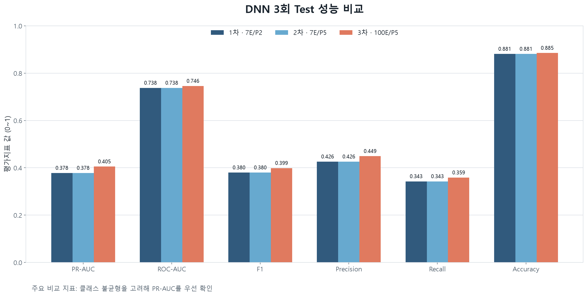
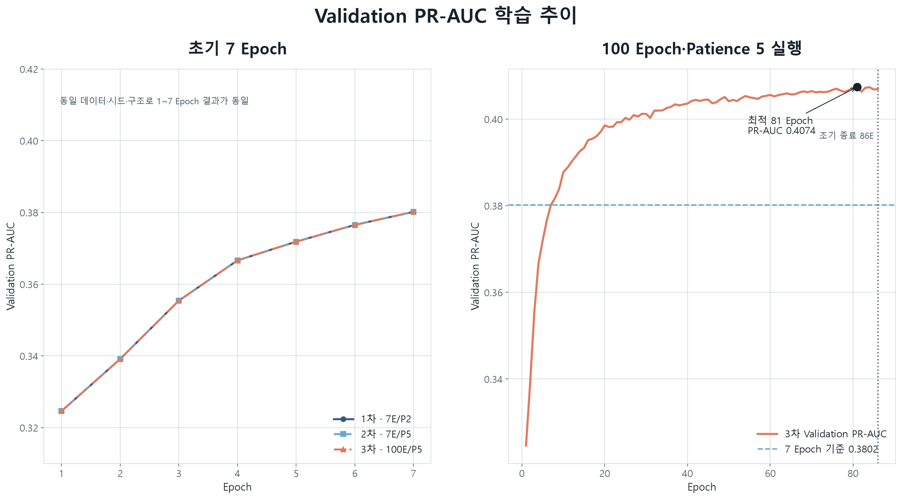
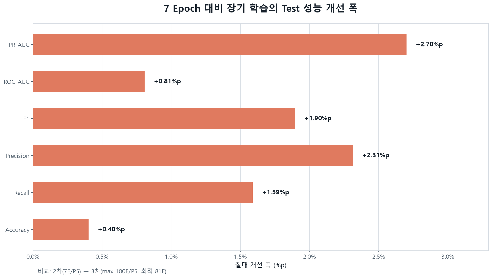
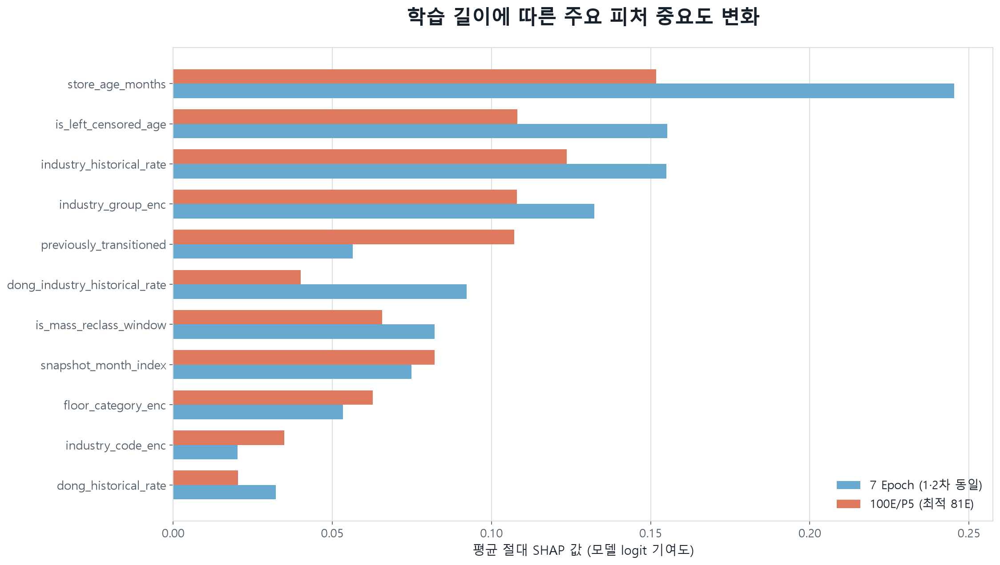

# DNN 3회 수행 결과 비교 보고서

## 1. 비교 목적

동일한 PJW 전처리 데이터와 DNN 구조에서 최대 Epoch와 조기 종료 patience 변경이 모델 성능에 미친 영향을 비교한다. 클래스 불균형이 있는 폐업 예측 문제이므로 **Test PR-AUC를 주요 성능 지표**로 사용한다.

## 2. 공통 학습 조건

| 항목 | 설정 |
|---|---|
| 데이터 | `modeling_dataset_refined_pjw.csv` |
| 전처리 | `preprocessing_dataset_pjw` |
| 제외 전처리 | `preprocessing_dataset_pmh` |
| 전체 데이터 | 1,889,582행 |
| 분할 | Train 1,137,077 / Validation 375,496 / Test 377,009 |
| 입력 피처 | 34개 |
| 모델 구조 | Input 34 → 256 → 128 → 64 → Output 1 |
| 모델 파라미터 | 51,073개 |
| GPU | NVIDIA GeForce RTX 3070 |
| Batch size | 4,096 |
| Seed | 42 |
| 모델 선택 기준 | Validation PR-AUC |
| 임계값 선택 | Validation F1 최대 지점 |

## 3. 실행별 설정 및 결과

| 구분 | 최대 Epoch | Patience | 실제 종료 | 최적 Epoch | Validation PR-AUC | 비고 |
|---|---:|---:|---:|---:|---:|---|
| 1차 | 7 | 2 | 7 | 7 | 0.3802 | 최초 PJW DNN 기준선 |
| 2차 | 7 | 5 | 7 | 7 | 0.3802 | patience만 5로 변경 |
| 3차 | 100 | 5 | 86 | 81 | **0.4074** | 5회 연속 미개선으로 조기 종료 |

1차와 2차는 7 Epoch 동안 매회 성능이 개선되어 조기 종료가 발생하지 않았다. 따라서 patience 변경은 결과에 영향을 주지 않았고 두 실행의 모델 가중치와 예측값도 동일했다.

## 4. Test 성능 비교

| 지표 | 1차: 7E/P2 | 2차: 7E/P5 | 3차: 100E/P5 | 2차 대비 변화 |
|---|---:|---:|---:|---:|
| PR-AUC | 0.3781 | 0.3781 | **0.4051** | **+0.0270** |
| ROC-AUC | 0.7377 | 0.7377 | **0.7458** | **+0.0081** |
| F1 | 0.3798 | 0.3798 | **0.3988** | **+0.0190** |
| Precision | 0.4260 | 0.4260 | **0.4492** | **+0.0231** |
| Recall | 0.3427 | 0.3427 | **0.3586** | **+0.0159** |
| Accuracy | 0.8812 | 0.8812 | **0.8852** | **+0.0040** |
| 판정 임계값 | 0.6937 | 0.6937 | 0.6890 | -0.0047 |

## 5. Epoch별 학습 추이

3차 실행은 최대 100 Epoch로 설정했지만 81 Epoch에서 최고 Validation PR-AUC `0.4074`를 기록한 뒤 82~86 Epoch 동안 최고치를 넘지 못했다. `patience=5` 조건에 따라 86 Epoch에서 정상 종료됐으며, 최종 저장 모델은 81 Epoch 모델이다.

## 6. 장기 학습 개선 효과

7 Epoch에서 100 Epoch·patience 5 설정으로 확장한 결과 모든 Test 지표가 개선됐다. 특히 주요 지표인 PR-AUC는 `0.3781 → 0.4051`로 절대값 `0.0270` 증가했다.

## 7. SHAP 피처 중요도 변화

세 실행 모두 `store_age_months`가 가장 중요한 피처였다. 장기 학습 모델에서는 `previously_transitioned`의 상대적 중요도가 높아졌고, 피처별 기여도가 초기 모델보다 분산됐다.

## 8. 발표용 결론

- patience만 `2 → 5`로 바꾼 2차 실행은 최대 Epoch가 7로 동일해 성능 변화가 없었다.
- 최대 Epoch를 100으로 확장한 3차 실행은 86 Epoch에서 조기 종료됐고 최적 모델은 81 Epoch였다.
- 3차 모델은 7 Epoch 모델보다 Test PR-AUC, ROC-AUC, F1, Precision, Recall이 모두 개선됐다.
- 최종 후보로는 3차 `100E/P5`의 81 Epoch 모델이 적합하다.
- 출력값은 보정된 폐업 확률이 아니라 폐업 위험점수다.
- SHAP 결과는 모델의 예측 기여도이며 실제 폐업 원인이나 인과관계를 의미하지 않는다.
- 실제 배포 전에는 누적·과거 비율 계열 피처가 예측 시점에 생성 가능한지 다시 확인해야 한다.

## 9. 실행 결과 위치

| 구분 | 경로 |
|---|---|
| 1차 | `models/dl/saved/runs/DNN_20260828_004659_cc977ca_pjw_official` |
| 2차 | `models/dl/26.08.28-dl-0920/DNN_20260828_092220_87442d5_pjw_official` |
| 3차 | `models/dl/26.08.28-dl-e100-p5/DNN_20260828_094006_7e84a4a_pjw_official` |
